# AdvCam-Hide-Adv-with-Natural-Styles 
[Paper link](https://arxiv.org/abs/2003.08757)

Code for "Adversarial Camouflage: Hiding Physical-World Attacks with Natural Styles"
<p align='center'>
  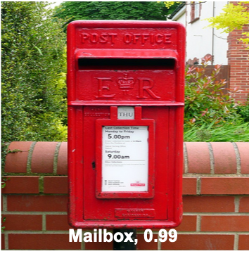
  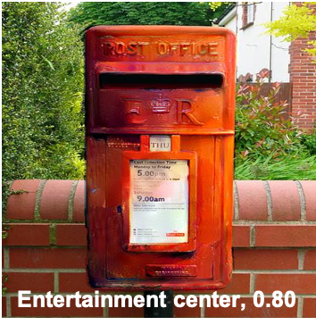
  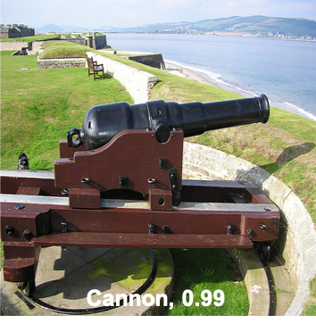
  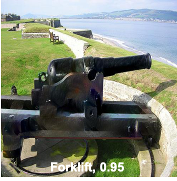
</p>
<p align='center'>
  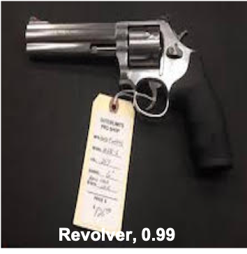
  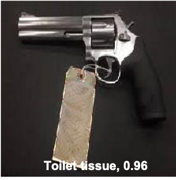
  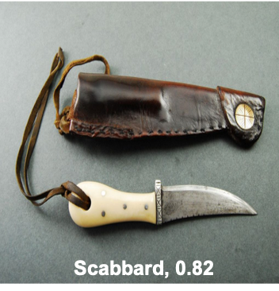
  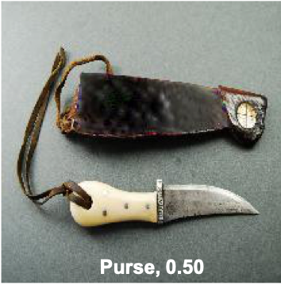
</p>
<p align='center'>
  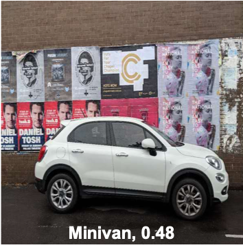
  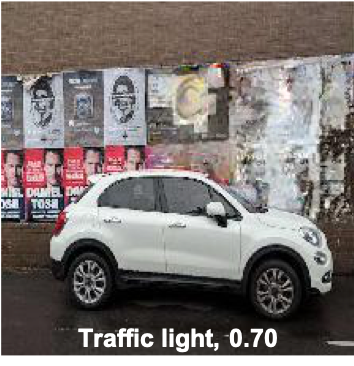
  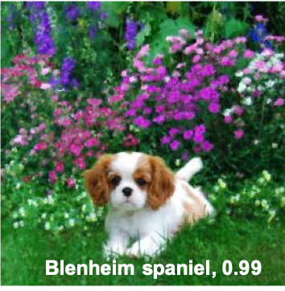
  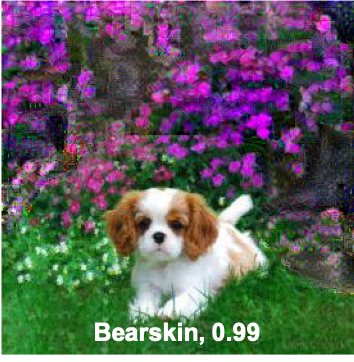
</p>

## Installation

#### Dependencies
* cuda==9.0.176
* cudnn==7.0.5

We highly recommend using [conda](https://www.anaconda.com/distribution/).
```sh
conda create -n advcam_env python=3.6
source activate advcam_env
```
After activating virtual environment:
```sh
git clone https://github.com/RjDuan/AdvCam-Hide-Adv-with-Natural-Styles
cd AdvCam-Hide-Adv-with-Natural-Styles
pip install --user --requirement requirements.txt
```
Download [VGG19.npy](https://mega.nz/#!xZ8glS6J!MAnE91ND_WyfZ_8mvkuSa2YcA7q-1ehfSm-Q1fxOvvs) under folder /vgg19

**Note: We use tensorflow v1 in the code, incompatible with python>3.6 when we test.**

## Usage
#### Quick Start
Running our given example:
```sh
sh run.sh
```
And the directory :

|--physical-attack-data	<br/>
|&emsp;&emsp;|--content	<br/>
|&emsp;&emsp;&emsp;&emsp;|--stop-sign	<br/>
|&emsp;&emsp;|--style	<br/>
|&emsp;&emsp;&emsp;&emsp;|--stop-sign	<br/>
|&emsp;&emsp;|--content-mask	<br/>
|&emsp;&emsp;|--style-mask	<br/>
  
**Note: we set iteration as 4000 for making sure a successful adversary, but adv with better visual performance can be found in earlier iterations.**

#### Basic Usage
* Path to images
  * Put target image, style image, and their segmentations in folders. We set the name of target/style image and their segmentation are same by default. 
  * Modify run.sh and advcam_main.py if you change the path to images.
  * We define the segmentation in following way, you can change it in utils.py

Segmentation type | RGB value
------------ | -------------
UnAttack | <(128,128,128)
Attack | >(128,128,128)

* Parameters
  * Parameters can be speicified in either run.sh or advcam_main.py.

* Run the follow scipt
```sh
sh run.sh
```
## Usage example

A few motivating examples of how AdvCam can be used. 

#### Adv Images
Three adverarial images generated by AdvCam with natural adversarial perturbation.

#### Physical Test

#### Google Image Test
Or use AdvCam to hide your image from Google Image Search

Test image can be download [here](https://github.com/RjDuan/AdvCam-Hide-Adv-with-Natural-Styles/blob/master/results/pikachu.jpg)

#### More generation and test details can be found in video [AdvCam](https://www.youtube.com/watch?v=gk3NHY_gpvg)

## Q&A
* About the dataset.

Data is collected from ImageNet, open source imagehub and some are caputured by ourselves. Data used in our paper can be downloaded [here](https://drive.google.com/file/d/1K5bHwPOcKtteArafYoqzpW1FGzF_ZLYT/view?usp=sharing). We provide both images and their masks (segmentaions).

## Acknowledgments
* We use [Yang's code](https://github.com/LouieYang/deep-photo-styletransfer-tf) for style transfer part.
* We use VGG19 implemented by [Chris](https://github.com/machrisaa/tensorflow-vgg)

## Citation
```
@inproceedings{duan2020adversarial,
  title={Adversarial Camouflage: Hiding Physical-World Attacks with Natural Styles},
  author={Duan, Ranjie and Ma, Xingjun and Wang, Yisen and Bailey, James and Qin, A Kai and Yang, Yun},
  booktitle={Proceedings of the IEEE/CVF Conference on Computer Vision and Pattern Recognition},
  pages={1000--1008},
  year={2020}
}
```

